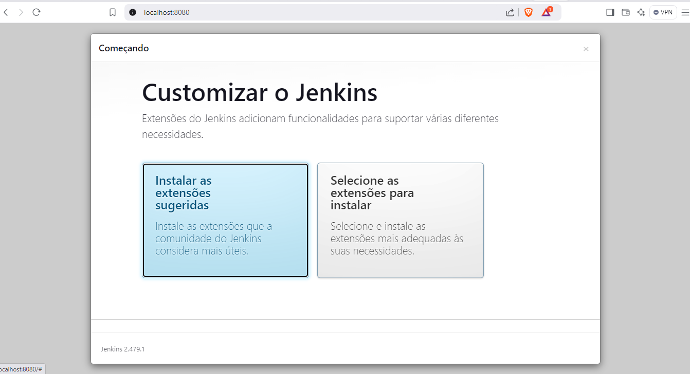
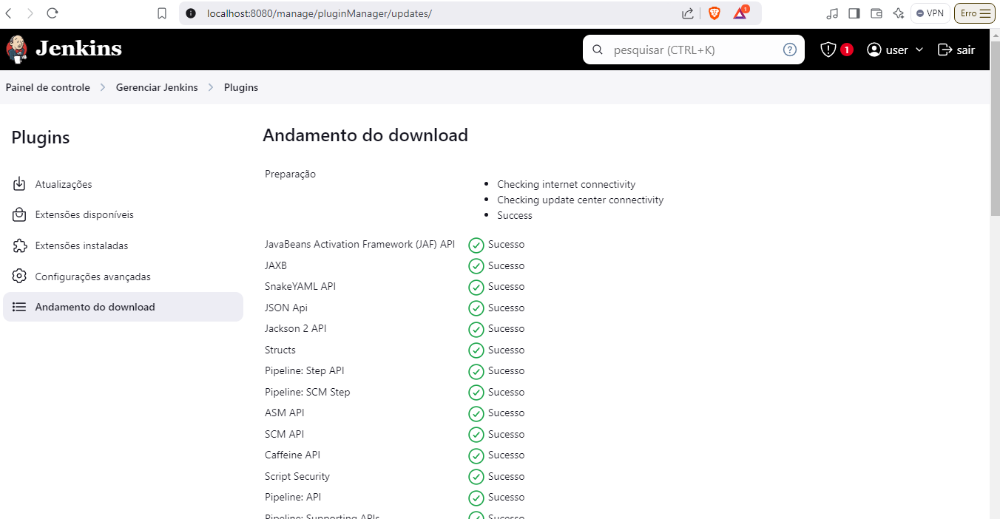
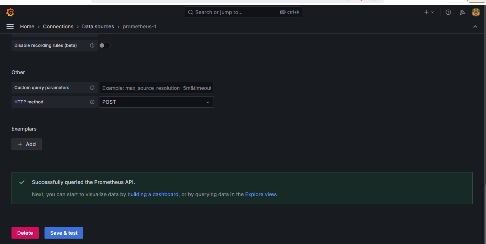
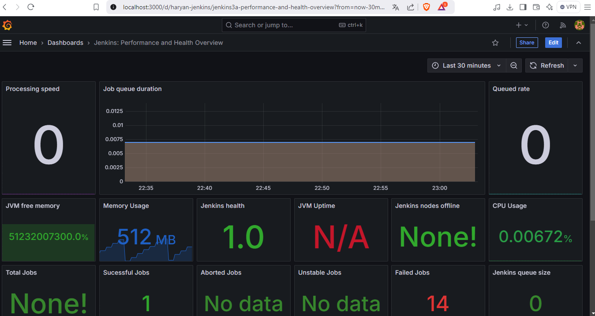

# Instalação e Configuração do Jenkins com Kubernetes

Esta prática descreve o meu processo de instalação e configuração do Jenkins com Kubernetes, incluindo a configuração de armazenamento persistente, instalação de monitoramento com Prometheus e Grafana, e criação de pipelines. Foi utilizado o Helm.

## Autor

Yan Carlos Rocha da Silva

## Pré-requisitos

- Kubernetes configurado e funcional
- Helm instalado
- Acesso ao terminal/CLI do Kubernetes
- Docker instalado (para alguns cenários de build)

## Passos

### 1. Criação do Namespace no Kubernetes

Navegue até a pasta Jenkins, em `manifestos`, e crie o namespace para o Jenkins:

```bash
kubectl apply -f ./jenkins/resources/namespace.yml
```

### 2. Criação do Storage

Navegue até a pasta Storage e crie o pv e pvc do jenkins:

```bash
kubectl apply -f ./jenkins/storage/pv-pvc-jenkins.yml
```
Vamos verificar se deu tudo certo:

```bash
kubectl describe pvc jenkins-pvc -n jenkins
```
Com os recursos devidamente criados e configurados iremos partir para a instalação via Helm

### 3. Instalação do jenkins com Helm

Com o Helm devidamente instalado, execute:

```bash
helm repo add bitnami https://charts.bitnami.com/bitnami
```
Vale salientar que precisei fazer algumas alterações no arquivo values.yaml para que funcionasse da forma devida, no repositório o arquivo modificado estará disponível para fins de replicação desse tutorial. Vamos prosseguir com a instalação do jenkins

```bash
helm install jenkins -f ./jenkins/resources/values.yml bitnami/jenkins --namespace jenkins
```

Se quiser alterar algo você pode futuramente executar:

```bash
helm upgrade --install jenkins -f ./jenkins/values.yml bitnami/jenkins --namespace Jenkins
```

Vamos verificar se o pod está com o status de running 2/2, devido tentativas de subir sidecar container o mesmo traz em conjunto um container podman, execute:

```bash
kubectl get pods -n jenkins
```

Utilizaremos port-forward para expor o pod:

```bash
kubectl port-forward nome_pod 8080:8080 -n jenkins
```



No endereço http://localhost:8080 será possível agora visualizar o jenkins, o usuário setado previamente é 'user', a senha inicial pode ser facilmente recuperada na secret jenkins que foi gerada, escolha a ferramenta ou estratégia do seu gosto, eu visualizei via octant.

Deixo abaixo uma estratégia mais trabalhosa, três comandos seguidos:

```bash
kubectl exec -n jenkins -it nome_pod -- /bin/bash

cat /var/jenkins_home/secrets/initialAdminPassword

exit
```

Após isso instale as extensões sugeridas e continue com o processo de configuração inicial.



### 4. Monitoramento Grafana e Prometheus

Também irei utilizar o Helm para fazer a instalação por questão de simplicidade, e no caso do prometheus as configurações fornecidas no values.yaml são mais do que suficientes.

```bash
helm repo add prometheus-community https://prometheus-community.github.io/helm-charts

helm repo update

helm install prometheus prometheus-community/kube-prometheus-stack --namespace jenkins
```

Vamos verificar o estado de nosso namespace

```bash
kubectl get all -n jenkins
```

Utilizando o port-forward vamos expor o grafana

```bash
 kubectl port-forward svc/prometheus-grafana 3000:80 -n jenkins
```

Veja que será necessário fornecer o usuário e senha, vamos verificar o secret de forma análoga ao que foi feito no jenkins, no meu caso o user é 'admin' e a senha é 'prom-operator'

Verifique o nome do service do prometheus e configure um novo data source no grafana, no meu caso: "http://prometheus-operated:9090".



Será necessário criar um servicemonitor para o jenkins, aplique o seguinte arquivo:

```bash
 kubectl apply -f ./jenkins/resources/service-monitor.yml
-n jenkins
```
Vamos agora importar um dashboard, o dashboard escolhido foi o número: 9964



Verificamos assim que o serviço assim está sendo monitorado, porém não há jobs em execução no jenkins, o que nos leva a próxima etapa dessa prática.

### 4. Configurações para subir pipelines

Volte para o jenkins web e instale os seguintes plugins:
- Docker pipeline
- Kubernetes
- Gitlab

Será necessário criar um role e um role binding para garantir que o jenkins tenha permissões no cluster para realizar alterações, aplique o arquivo:

```bash
 kubectl apply -f ./jenkins/resources/jenkins-role-role-binding.yml -n jenkins
```
Na nossa interface web criaremos a conexão de uma nova cloud que será nosso cluster local.


Com a criação do job vieram os erros, imaginei no primeiro cenário em realizar de forma plena o deploy de uma aplicação passando os stages: build, push e deploy pelo menos.

Ao tentar realizar o build me deparei com o problema de que não tinha no meu pod jenkins docker, então seria necessário um agente auxiliar. Verifiquei na literatura e uma das possibilidades era utilizar sidecar container, então alterei o values.yml para utilizar o podman. Essa técnica funcionou no primeiro momento mas não consegui integrar na pipeline.


## Considerações finais

Com o tutorial em questão foi possível realizar a configuração do jenkins em um cluster Kubernetes, com persistência de dados utilizando pv e pvc. Também foi disponibilizado o processo de monitoramento com grafana e prometheus, bem como os arquivos necessários.